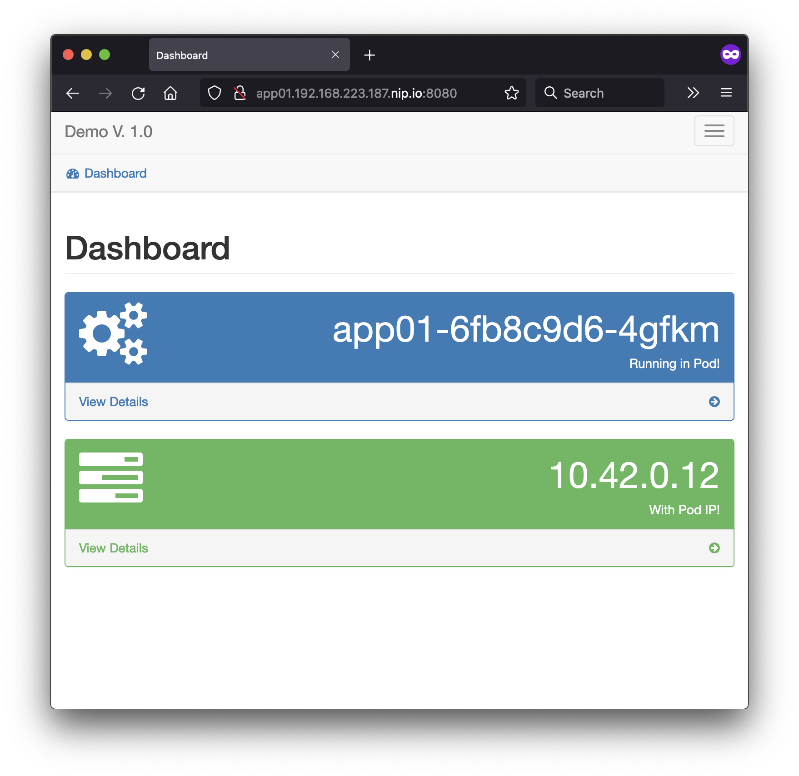

# Publicando nuestra primera aplicación en Kubernetes

Para esta Laboratorio, se iniciaran creando un namespace.

Todos los recursos de kubernetes los puede crear de dos maneras:

* Imperativa: Ejecutando comandos para realizar la tarea deseada.
* Declaratva: Creando un manifiesto de kubernetes en formato YAML, en donde se describe el estado del recurso.

## Creación de Namespace:

#### Imperativa:

```bash
kubectl create namespace demoapp01 --save-config
```

La opción ```--save-config```, guarda la configuración aplicada en una anotación dentro de metadata.

Salida del comando:
```
namespace/demoapp01 created
```

Podemos obterner la defición del recurso creado ejecutando:

```
kubectl get namespace demoapp01
```

Salida del comando:

```yaml
apiVersion: v1
kind: Namespace
metadata:
  annotations:
    kubectl.kubernetes.io/last-applied-configuration: |
      {"kind":"Namespace","apiVersion":"v1","metadata":{"name":"demoapp01","creationTimestamp":null},"spec":{},"status":{}}
  creationTimestamp: "DATE TIME STAMP"
  labels:
    kubernetes.io/metadata.name: demoapp01
  name: demoapp01
  resourceVersion: "2325"
  uid: **UUI**
spec:
  finalizers:
  - kubernetes
status:
  phase: Active
```


#### Declarativa

En el directorio k8s/ encontrará el archivo 

Con el contenido:

```yaml
apiVersion: v1      #<--- Versión reconocida por el API de k8s
kind: Namespace     #<--- Tipo del recurso
metadata:
  name: demoapp01   #<--- Nombre de recurso
  labels: 
    name: demoapp01 #<--- Listado de etiquetas
```

kubectl apply -f k8s/namespace.yaml

Salida del comando:

```
namespace/demoapp01 configured
```


Podemos obterner la defición del recurso creado ejecutando:

```
kubectl get namespace demoapp01 -o yaml
```

Salida del comando:


```yaml
apiVersion: v1
kind: Namespace
metadata:
  annotations:
    kubectl.kubernetes.io/last-applied-configuration: |
      {"apiVersion":"v1","kind":"Namespace","metadata":{"annotations":{},"labels":{"name":"demoapp01"},"name":"demoapp01"}}
  creationTimestamp: "2021-11-02T21:02:29Z"
  labels:
    kubernetes.io/metadata.name: demoapp01
    name: demoapp01
  name: demoapp01
  resourceVersion: "2564"
  uid: 74bbfb0f-f978-4abd-a385-f4363943f0d5
spec:
  finalizers:
  - kubernetes
status:
  phase: Active
```

Notar que se agregó una etiqueta

```yaml
metatada:
  label:
    name: demoapp01
```        

Y el la anotación ```kubectl.kubernetes.io/last-applied-configuration```, fue actualizado con la configuración de la definición del recuso en el archivo yaml.

Si tratamos de ejecutar de nuevo el comando, para aplicar los cambios:

```kubectl apply -f k8s/namespace.yaml```

Salida del comando:
```
namespace/demoapp01 unchanged
```

Notamos que no se ejecuta algún cambio, ya que el recurso creado en kubernetes es igual al recurso en la definición. 

### Actualizar un recurso de Kubernetes utilizando la forma declarativa

Vamos a editar nuestro recurso ubicado en ```k8s/namespace.yaml``` y agregaremos otra etqueta.

ORIGINAL:

```yaml
apiVersion: v1
kind: Namespace
metadata:
  name: demoapp01
  labels:
    name: demoapp01
``` 

MODIFICADO:

```yaml
apiVersion: v1
kind: Namespace
metadata:
  name: demoapp01
  labels:
    name: demoapp01
    lab: lab01
``` 

## Aplicamos los cambios

```kubectl apply -f k8s/namespace.yaml```

Salida del comando:
```
namespace/demoapp01 configured
```

Podemos obterner nuevamente la defición del recurso creado ejecutando:

```
kubectl get namespace demoapp01
```

Salida del comando:

```yaml
apiVersion: v1
kind: Namespace
metadata:
  annotations:
    kubectl.kubernetes.io/last-applied-configuration: |
      {"apiVersion":"v1","kind":"Namespace","metadata":{"annotations":{},"labels":{"lab":"lab01","name":"demoapp01"},"name":"demoapp01"}}
  creationTimestamp: "2021-11-02T21:02:29Z"
  labels:
    kubernetes.io/metadata.name: demoapp01
    lab: lab01
    name: demoapp01
  name: demoapp01
  resourceVersion: "3014"
  uid: 74bbfb0f-f978-4abd-a385-f4363943f0d5
spec:
  finalizers:
  - kubernetes
status:
  phase: Active
```

Notamos los cambios aplicados con una nueva etiqueta: ```lab: lab01``` y la actualización de la anotación ```
kubectl.kubernetes.io/last-applied-configuration```

# Creación de nuestra APP de Demo

Esta aplicación esta creado en python y utliza Flask

Utilizarremos la forma declarativa para crear estos recursos.

## Deployment

```kubectl apply -f k8s/deployment.yaml```

Salida del comando:

```
deployment.apps/app01 created
```

Obtemos el listado de recursos de tipo deploymet creados en el namespace demoapp01

```kubectl get deployments.apps -n demoapp01```

Salida del comando:

```
NAME    READY   UP-TO-DATE   AVAILABLE   AGE
app01   1/1     1            1           2m46s
```

Podemos observar que se creó el deployment app01 con 1 replica y 1/1 pods estan en estado ```READY```.

Podemos obterner la defición del recurso de tipo deployment creado en el namespace demoapp01, ejecuando:

```kubectl get deployments.apps -o yaml app01 -n demoapp0```

Se ha omitido la salida de este comando, deberá de mostrar la definición del recurso en formato yaml.

Podemos obtener únicamente el atributo de ```kubectl.kubernetes.io/last-applied-configuratio```, ejecutando:

```kubectl apply view-last-applied deployment/app01 -n demoapp01```

Salida del comando:

```yaml
apiVersion: apps/v1
kind: Deployment
metadata:
  annotations: {}
  labels:
    app: app01
  name: app01
  namespace: demoapp01
spec:
  replicas: 1
  selector:
    matchLabels:
      app: app01
  strategy: {}
  template:
    metadata:
      creationTimestamp: null
      labels:
        app: app01
    spec:
      containers:
      - image: quay.io/jandrade/democontainerapp:latest
        name: democontainerapp
        resources:
          limits:
            cpu: 100
            memory: 128Mi
          requests:
            cpu: 10m
            memory: 10Mi
```

Se deberá mostrar exacamente el mismo contenido del archivo de la definición del recurso.


Obtenemos la información de los pods creados por el recurso de deployment en el namespace demoapp01

```kubectl get pods -n demoapp01```

Salida del comando:

```
NAME                    READY   STATUS    RESTARTS   AGE
app01-XXXX-YYYY   1/1     Running   0          64s
```


## Service

Podemos crear la definición del servicio a partir del deployment creado anteriormente para que tome las etiquetas de los pods creados y los utilice como "selector" para el servicio.


```kubectl expose deployment app01 -n demoapp01 -o yaml --dry-run=client```

Salida del comando:

```yaml
apiVersion: v1
kind: Service
metadata:
  creationTimestamp: null
  labels:
    app: app01
  name: app01
  namespace: demoapp01
spec:
  ports:
  - port: 8080
    protocol: TCP
    targetPort: 8080
  selector:
    app: app01
status:
  loadBalancer: {}
```

Esta es la definición del servicio, podemos almacenarla en k8s/service.yaml o utilizar el archivo de ejemplo.

```kubectl apply -f k8s/service.yaml```

Salida del comando:

```
service/app01 unchanged
```

## Ingress

Podemos crear la definición del ingress por medio del siguiente comando:


```kubectl create ingress test -o yaml --dry-run=client  --rule="test.192.168.223.187.nip.io/*=app01:8080" -n demoapp01```


La opción de creación del ingress esta compuesta por:

```
--rule  "FQDN/PATH=NOMBRE_SERVICIO:PUERTO_SERVICIO 
```

| Opción | Valor |
|------|------------------------------|
| FQDN | app01.SU_IP_VM_PRUEBA.nip.io |
| NOMBRE_SERVICIO | app01 |
| PURTO_SERVICIO | 8080 |


Salida del comando:

```yaml
apiVersion: networking.k8s.io/v1
kind: Ingress
metadata:
  creationTimestamp: null
  name: app01
  namespace: demoapp01
spec:
  rules:
  - host: app01.192.168.223.187.nip.io
    http:
      paths:
      - backend:
          service:
            name: app01
            port:
              number: 8080
        path: /
        pathType: Prefix
status:
  loadBalancer: {}
```


Esta es la definición del ingress, podemos almacenarla en k8s/ingress.yaml o utilizar el archivo de ejemplo.

```kubectl apply -f k8s/ingress.yaml```

Salida del comando:


```
ingress.networking.k8s.io/app01 created
```

# Test App


## Curl

```curl http://app01.192.168.223.187.nip.io:8080 | head```

Este puerto es el que definimos par el load Balancer de k3d

Salida del comando:

```
% Total    % Received % Xferd  Average Speed   Time    Time     Time  Current
                                 Dload  Upload   Total   Spent    Left  Speed
100  5120  100  5120 <!DOCTYPE html> 0      0 --:--:-- --:--:-- --:--:--     0
 <html>
   <head>
     <title>Dashboard</title>
0    <meta name="viewport" content="width=device-width, initial-scale=1.0">
...
```

## Browser




Siga con  para aprender a escalar y detectar cambios en nuestro deployment. 


